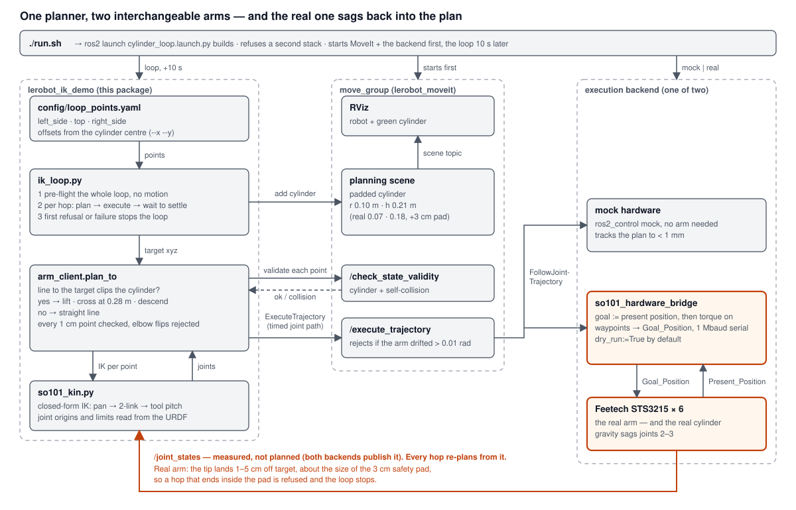

# LerobotFwd_InvKinematics — SO-101 Forward & Inverse Kinematics, MoveIt and Real-Hardware Control

A ROS 2 (Jazzy) workspace for the 5-DoF (+ gripper) **SO-101 robot arm**:
URDF/kinematic description, `ros2_control` simulation, MoveIt 2 motion
planning, **forward and inverse kinematics (derived, verified and documented)**,
and a real-hardware bridge that lets MoveIt plan and execute directly against
the physical Feetech-servo arm. On top of that, `lerobot_ik_demo` plans an
IK loop **around and over a cylinder** — in simulation and on the real arm —
with a single command (`./run.sh`).

**Jump to:** [Architecture](#architecture) ·
[One-command demo](#one-command-demo) ·
[Forward & inverse kinematics](#kinematics) ·
[Setup](#setup)

---

## 📂 Repository Structure

```text
.
├── README.md                     # This guide
├── requirements.txt               # Python dependencies
├── setup.py / setup.sh / activate.sh   # Environment setup
├── test_installation.sh           # Installation verification utility
├── inspect_urdf.py                # URDF structure inspector tool
├── live_diagnostic.py             # Real-time ROS2 TF & joint states monitor
│
├── config/
│   └── so101_params.yaml          # Kinematic offsets and joint limit definitions
│
├── labs/
│   └── lab1_1_visualize_urdf.py   # URDF visualization walkthrough
│
└── ros2_ws/                       # ROS 2 workspace
    └── src/
        ├── lerobot_description/   # URDF/xacro, meshes, Gazebo launch
        ├── lerobot_controller/    # ros2_control controllers for sim/mock hardware
        ├── lerobot_moveit/        # MoveIt config, RViz, named poses, pose automation, FK docs
        ├── lerobot_hardware/      # Real-hardware bridge (Feetech servos over serial)
        └── lerobot_ik_demo/       # IK loop around/over a cylinder, sim-to-real, IK docs, run.sh
```

Package-level docs:
[`lerobot_moveit/README.md`](ros2_ws/src/lerobot_moveit/README.md),
[`lerobot_hardware/README.md`](ros2_ws/src/lerobot_hardware/README.md) and
[`lerobot_ik_demo/README.md`](ros2_ws/src/lerobot_ik_demo/README.md).

---

<a id="architecture"></a>

## 🗺️ Architecture

**The whole system.** One planner talks only to `move_group`; mock hardware and the real Feetech arm sit behind the
same `FollowJointTrajectory` interface, so the identical code runs on both. The orange path is what makes sim-to-real
different: the real arm comes back sagged, every hop re-plans from the measured state.



**MoveIt layer.** Files in (URDF, SRDF, kinematics, limits, controllers) → `move_group` → clients (RViz, scripts) →
one `FollowJointTrajectory` interface to any backend.


| Package | Role | Docs |
|---|---|---|
| `lerobot_description` | URDF/xacro, meshes, Gazebo launch | — |
| `lerobot_controller` | `ros2_control` controllers for mock hardware / Gazebo | — |
| `lerobot_moveit` | MoveIt config, RViz, named poses; **forward-kinematics derivation** | [README](ros2_ws/src/lerobot_moveit/README.md) · [architecture](ros2_ws/src/lerobot_moveit/docs/ARCHITECTURE.md) · [kinematics](ros2_ws/src/lerobot_moveit/docs/KINEMATICS.md) |
| `lerobot_hardware` | Feetech servo bridge exposing `FollowJointTrajectory` | [README](ros2_ws/src/lerobot_hardware/README.md) |
| `lerobot_ik_demo` | IK loop around/over a cylinder, sim to real; **inverse-kinematics derivation** | [README](ros2_ws/src/lerobot_ik_demo/README.md) · [architecture](ros2_ws/src/lerobot_ik_demo/docs/ARCHITECTURE.md) · [IK](ros2_ws/src/lerobot_ik_demo/docs/INVERSE_KINEMATICS.md) · [real-arm bring-up](ros2_ws/src/lerobot_ik_demo/docs/HARDWARE_BRINGUP.md) |

---

<a id="one-command-demo"></a>

## ▶️ One-command demo

```bash
cd ros2_ws/src/lerobot_ik_demo
./run.sh                                  # mock arm, plan-only: safe anywhere, nothing moves
./run.sh --execute                        # mock arm, actually loops
./run.sh real                             # real arm connected READ-ONLY (dry run)
./run.sh real --live --execute --x 0.0708 --y -0.2731     # real arm — MOVES (asks you to confirm)
```

The loop visits a point to the left of the cylinder, one over the top, and one to the right, arching over the padded
cylinder whenever the straight line would clip it. See
[`lerobot_ik_demo/README.md`](ros2_ws/src/lerobot_ik_demo/README.md) and, before touching real hardware,
[`HARDWARE_BRINGUP.md`](ros2_ws/src/lerobot_ik_demo/docs/HARDWARE_BRINGUP.md).

---

<a id="kinematics"></a>

## 🧮 Forward & Inverse Kinematics

Frame `base`: **+x = the arm's left, −y = forward, +z = up**. Full derivations, every intermediate number, and scripts
that reproduce them: [forward](ros2_ws/src/lerobot_moveit/docs/KINEMATICS.md) (`fk_calc.py`) and
[inverse](ros2_ws/src/lerobot_ik_demo/docs/INVERSE_KINEMATICS.md) (`ik_calc.py`).

### Forward kinematics — joint angles → gripper pose

Every joint has a fixed origin transform from the URDF (`xyz`, `rpy`) and rotates about its own $z$ axis. The pose of
link $i$ is one matrix product per joint:

$$
\boxed{\,T_i \;=\; T_{i-1}\; T_{\text{origin},i}\; R_z(q_i)\,},\qquad
T_{\text{origin},i}=\begin{bmatrix} R(\text{rpy}_i) & \mathbf{p}_i \\ \mathbf{0}^{\top} & 1 \end{bmatrix},\qquad T_0=I
$$

The gripper frame is $T_5$. Joints 2–4 are parallel and joint 1 is vertical, so the gripper origin has a compact closed
form. With $R(t)$ the 2-D rotation by $-t$ (a positive joint angle turns the arm's plane clockwise):

$$
\begin{pmatrix}\rho\\ z\end{pmatrix}
= \mathbf{p}_2 + R(q_2)\,\mathbf{a} + R(q_2+q_3)\,\mathbf{b} + R(q_2+q_3+q_4)\,\mathbf{c},
\qquad
\begin{aligned}
x &= p_x - \rho\sin q_1 + \lambda\cos q_1\\
y &= p_y - \rho\cos q_1 - \lambda\sin q_1
\end{aligned}
$$

| constant (from the URDF) | value |
|---|---|
| pan axis $(p_x, p_y)$ | (0.02079, −0.02307) m |
| upper arm $\lVert\mathbf a\rVert$ | 0.11600 m |
| forearm $\lVert\mathbf b\rVert$ | 0.13500 m |
| wrist → gripper origin $\lVert\mathbf c\rVert$ | 0.06110 m |
| plane offset $\lambda$ | −0.176 mm |

**Worked example — the `home` pose.** $q_{1..4}=(0.01534,\,-0.01534,\,0.23476,\,-0.01227)$ rad gives
$\rho=0.24926$ m, $z=0.22522$ m, hence the gripper origin **$(0.01679,\,-0.27230,\,0.22522)$ m**. This equals MoveIt's
`/compute_fk` to $3\times10^{-16}$ m over six poses and all six links.

### Inverse kinematics — gripper position + tool pitch → joint angles

The arm has five joints, so it cannot reach an arbitrary 6-D pose: the target is the gripper position $(x,y,z)$ plus the
tool pitch $\varphi=q_2+q_3+q_4$; the wrist roll $q_5$ is free. With $\mathbf d=(x-p_x,\;y-p_y)$ and
$\alpha=\operatorname{atan2}(d_y,d_x)$ the solution is closed form:

$$
\begin{aligned}
q_1 &= -\alpha \pm \arccos\frac{\lambda}{\lVert\mathbf d\rVert}, \qquad \rho=-\sin q_1\,d_x-\cos q_1\,d_y\\[4pt]
\mathbf W &= (\rho,z)-\mathbf p_2-R(\varphi)\,\mathbf c\\[4pt]
\cos\theta &= \frac{\lVert\mathbf W\rVert^{2}-\lVert\mathbf a\rVert^{2}-\lVert\mathbf b\rVert^{2}}{2\,\lVert\mathbf a\rVert\,\lVert\mathbf b\rVert},
\qquad q_3=(\angle\mathbf b-\angle\mathbf a)\mp\arccos(\cos\theta)\\[4pt]
q_2 &= \angle\!\left(\mathbf a+R(q_3)\,\mathbf b\right)-\angle\mathbf W,
\qquad q_4=\varphi-q_2-q_3
\end{aligned}
$$

The $\pm$ gives the two pan solutions (arm reaching in front of / behind its own axis) and the $\mp$ the two elbow
branches; candidates outside the joint limits are discarded. A target is reachable only if
$\lvert\cos\theta\rvert\le1$, i.e. $0.019\ \text{m}\le\lVert\mathbf W\rVert\le0.251\ \text{m}$.

**Worked example — recovering `home` from its own tip position.** Target $(0.01679,\,-0.27230,\,0.22522)$ m,
$\varphi=0.20714$ rad:

| step | result |
|---|---|
| pan | $q_1=+0.01534$, $\rho=0.24926$ m |
| wrist point | $\mathbf W=(0.15907,\;0.08870)$, $\lVert\mathbf W\rVert=0.18213$ m |
| elbow | $\cos\theta=+0.04754\;\Rightarrow\;\theta=87.275^\circ$ |
| branch B (in limits) | $q_3=+0.23476$, $q_2=-0.01534$, $q_4=-0.01227$ — **exactly `home`** |
| branch A | $q_3=-2.812$ rad — outside $[-1.745,\,+1.571]$, discarded |

A second worked example (the loop's own `left_side` target) and the derivation are in
[`INVERSE_KINEMATICS.md`](ros2_ws/src/lerobot_ik_demo/docs/INVERSE_KINEMATICS.md).

**How it was checked** (`ik_calc.py --check` / `--moveit`): over 1 823 random poses the closed form has FK error
≤ 4.5 µm; the planner's numerical solver (`so101_kin.py`) solves 99.7–99.9 % in the region the loop works in;
MoveIt's KDL solved 73/76 and 71/76 exactly-reachable targets (near seed / from `home`), the closed form 76/76.

---

## 🛠️ System Prerequisites

- **Operating System:** Ubuntu 22.04 LTS (Humble) or Ubuntu 24.04 LTS (Jazzy)
- **Python:** 3.10+
- **ROS 2:** Humble (Ubuntu 22.04) or Jazzy (Ubuntu 24.04)
- **Git:** `sudo apt install git`
- For real-hardware use: an SO-101 arm on Feetech STS3215 servos, connected
  over USB serial (default `/dev/ttyACM0`)

---

<a id="setup"></a>

## 🚀 Setup & Installation

### Step 1: Clone the Repository
```bash
git clone https://github.com/sruthihsr/LerobotFwd_InvKinematics.git
cd LerobotFwd_InvKinematics
```

### Step 2: Run the Setup Script
Detects your ROS 2 install, installs system dependencies, creates a Python
virtual environment, runs `rosdep`, and builds `ros2_ws`:
```bash
chmod +x setup.sh
./setup.sh
```
*You may be prompted for your sudo password to install system packages.*

### Step 3: Activate the Environment
Run this in every new terminal:
```bash
source activate.sh
```

### Step 4: Verify Installation
```bash
./test_installation.sh
```

---

## 📖 URDF Visualization

Understand the URDF, inspect the SO-101's physical dimensions and kinematic
links, and visualize joints/coordinate frames in RViz.

```bash
source activate.sh
ros2 launch lerobot_description so101_display.launch.py
```
A Joint State Publisher GUI and RViz window open — use the sliders to move
joints and watch the 3D model and TF tree update live.

Or inspect the parsed joint limits/offsets directly:
```bash
python3 labs/lab1_1_visualize_urdf.py
python3 inspect_urdf.py
```

---

## 🧪 Forward-Kinematics Lab (MuJoCo)

Standalone forward-kinematics lab — no ROS 2 needed, just `pip install
mujoco`. Loads the SO-101 MJCF model
(`ros2_ws/src/lerobot_description/mujoco/`, reusing the same meshes as the
URDF), sets joint angles, runs MuJoCo's FK pass, and prints the resulting
pose of every link plus the end-effector.

```bash
python3 labs/lab1_2_test_fk_mujoco.py            # run the built-in test poses
python3 labs/lab1_2_test_fk_mujoco.py --view      # also open an interactive 3D viewer
```

---

## 🦾 MoveIt Planning & Real-Hardware Control

Bring up MoveIt with mock hardware (no physical arm needed):
```bash
ros2 launch lerobot_moveit so101_moveit.launch.py
```

Bring up MoveIt against the **real physical arm**:
```bash
ros2 launch lerobot_moveit so101_moveit.launch.py \
  use_real_hardware:=True dry_run:=False hardware_port:=/dev/ttyACM0
```
See [`lerobot_hardware/README.md`](ros2_ws/src/lerobot_hardware/README.md)
for calibration and safety notes before running with real hardware, and
[`lerobot_moveit/README.md`](ros2_ws/src/lerobot_moveit/README.md) for the
named poses (`home`, `pose_1`-`pose_4`, `vertical`, `vertical_down`) and the
`pose_loop.py` script that cycles through them unattended with per-move
verification.

---

## 🔍 Diagnostic & Inspection Tools

**URDF structure** — kinematic chain, parent-child links, joint axes/limits:
```bash
python3 inspect_urdf.py
```

**Live ROS 2 diagnostic** — confirms `/joint_states` publishing, QoS, and
live TF transforms (run alongside an active RViz session):
```bash
python3 live_diagnostic.py
```

---

## 📚 References
- **Robot Arm Design:** [SO-ARM100 GitHub](https://github.com/TheRobotStudio/SO-ARM100)
- **ROS 2 Documentation:** [ROS 2 Documentation Portal](https://docs.ros.org/)
