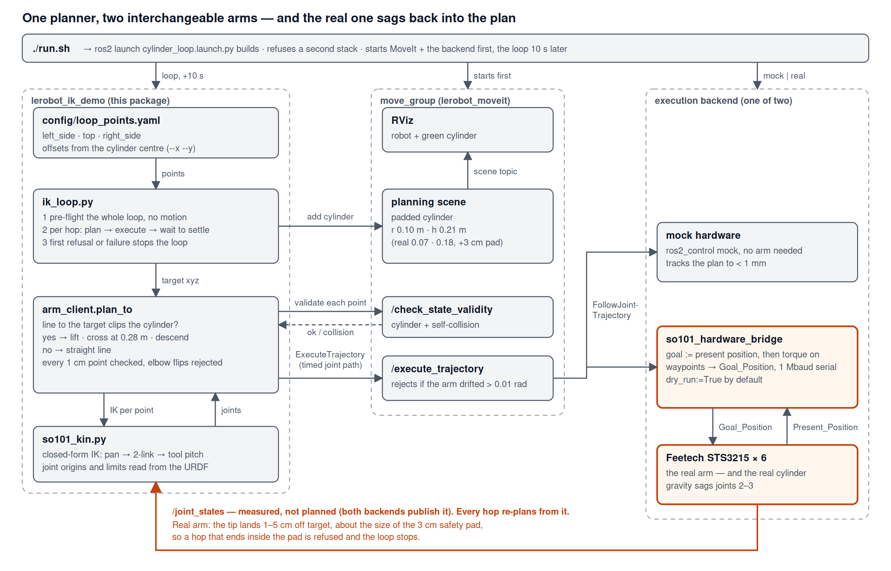

# lerobot_ik_demo

Inverse-kinematics **path planning around and over a cylinder** for the 5-DOF **SO-101** arm (ROS 2 Jazzy,
MoveIt 2). The gripper loops through positions on either side of a cylinder and one above it; hops that
would clip the cylinder are routed **over the top**. The same code runs on **mock hardware** (no arm needed)
and on the **real Feetech-servo arm** — sim to real.

```text
   left_side ──arch over the top──▶ top ──▶ right_side ──arch back──▶ left_side …
   (≈17 cm from the cylinder's centre, 12 cm high)    (30 cm high)
```



*The loop talks only to `move_group`; mock hardware and the real arm are interchangeable behind it. Details: [docs/ARCHITECTURE.md](docs/ARCHITECTURE.md).*

## Quick start — one command

```bash
cd ~/ros2_ws/src/lerobot_ik_demo          # or wherever this package lives
./run.sh                                   # mock arm, plan-only: safe anywhere, nothing moves
./run.sh --execute                         # mock arm, actually loops
./run.sh real                              # real arm, connected READ-ONLY (dry run)
./run.sh real --live --execute --x 0.0708 --y -0.2731     # real arm — MOVES (asks you to type 'yes')
```

`run.sh` builds the packages, checks that no other stack is running and the serial port is free, then starts
MoveIt + the arm backend + the loop with `ros2 launch lerobot_ik_demo cylinder_loop.launch.py`. RViz opens
with the robot and the green cylinder. Ctrl+C stops everything; on the real arm it holds its last pose.

| Option | Default | Meaning |
|---|---|---|
| `mock` \| `real` | `mock` | arm backend: ros2_control mock hardware, or the Feetech serial bridge |
| `--execute` | off | run the loop (otherwise plan-only pre-flight; the stack stays up for inspection) |
| `--live` | off | `real` only: `dry_run:=False` — **the bridge moves the arm** |
| `--x X --y Y` | `0.0708 -0.2731` | cylinder centre, base frame, metres (**measure yours**, see below) |
| `--clearance M` | `0.07` | gripper height above the padded cylinder top when crossing |
| `--speed R` | `0.2` | peak joint speed, rad/s |
| `--cycles N` | `0` | loops to run, `0` = until Ctrl+C |
| `--pause S` | `2.0` | seconds held at each point |
| `--points FILE` | `config/loop_points.yaml` | loop positions |
| `--port DEV` | `/dev/ttyACM0` | serial port |
| `--yes`, `--no-build`, `--force` | | skip the confirmation / build / other-stack check |

Equivalent without the wrapper:
`ros2 launch lerobot_ik_demo cylinder_loop.launch.py hardware:=mock execute:=True` (see the launch file for all arguments).

## Before you run on the real arm

Read **[docs/HARDWARE_BRINGUP.md](docs/HARDWARE_BRINGUP.md)** — the ordered checklist (dry run → measure the
cylinder → plan-only → live), what each refusal message means, and troubleshooting. Two things matter most:

1. **Measure the cylinder position.** The default `0.0708, -0.2731` is one particular setup (25 cm forward,
   5 cm left of the shoulder-pan axis). `x = 0.0208 + left`, `y = −0.0231 − forward`, in metres.
   Frame: **+x = the arm's left, −y = forward, +z up**.
2. **Expect the tip to land 1–5 cm off target** on the real arm (gravity sag on joints 2–3) against a 3 cm
   safety pad. If a hop ends inside the pad, the next hop is refused and the loop **stops** — by design.
   Mock hardware tracks to < 1 mm, so a clean mock run does *not* prove real-arm clearance.

## Requirements

* Ubuntu 24.04, **ROS 2 Jazzy** with MoveIt 2, `ros2_control`, `xacro`, `tf2_geometry_msgs`
* Sibling packages in the same workspace: `lerobot_description`, `lerobot_controller`, `lerobot_moveit`,
  `lerobot_hardware`
* System Python 3.12 (ROS's) with `numpy`, `PyYAML`; `feetech-servo-sdk` for the real arm

Full list and install commands: [`requirements.txt`](requirements.txt). **Use `/usr/bin/python3`, not conda** —
`rclpy` is ABI-locked to 3.12 (`run.sh` puts `/usr/bin` first on `PATH`).

## Install

```bash
cd ~/ros2_ws
rosdep install --from-paths src --ignore-src -r -y
/usr/bin/python3 -m pip install -r src/lerobot_ik_demo/requirements.txt
colcon build --packages-select lerobot_description lerobot_controller lerobot_hardware lerobot_moveit lerobot_ik_demo
```

## Configuration

`config/loop_points.yaml` — the loop, in order (returns to the first after the last). Positions are the
**gripper-frame origin**, in metres:

```yaml
points:
  - {name: left_side,  rel: [ 0.14, 0.10, 0.12]}   # rel: [dx, dy, z] = offset from the cylinder centre + absolute height
  - {name: top,        rel: [ 0.00, 0.00, 0.30]}
  - {name: right_side, rel: [-0.14, 0.10, 0.12]}   # xyz: [x, y, z] instead of rel: gives an absolute point
```

Relative points follow `--x/--y`. The `top` height must be ≥ padded cylinder top (0.21 m) + `--clearance`.
The pre-flight reports and skips points that are out of reach or in collision.

## Other tools

| Command | Purpose |
|---|---|
| `ros2 run lerobot_ik_demo click_to_move.py` | Click a point in RViz with the **Publish Point** tool → the arm goes there, arching over the cylinder if needed (`--plan-only` to preview) |
| `ros2 run lerobot_ik_demo over_the_top_demo.py [--execute]` | Scripted left → over the top → right crossing |
| `ros2 run lerobot_ik_demo ik_loop.py …` | The loop itself, with all its flags (`--escape`, `--escape-only`, `--point X Y Z`, …) |
| `ros2 run lerobot_ik_demo add_obstacle_scene.py [--object-xy X Y]` | Add the padded cylinder to MoveIt's scene (it disappears when `move_group` restarts) |
| Gazebo demo | `docs/GAZEBO_DEMO.md` (original obstacle demo; untested with the new scripts) |

(Run these with a running stack, using `PATH=/usr/bin:$PATH`, after sourcing ROS and the workspace.)

## Tests

```bash
source /opt/ros/jazzy/setup.bash && source ~/ros2_ws/install/setup.bash
cd ~/ros2_ws/src/lerobot_ik_demo && /usr/bin/python3 -m pytest test/ -q     # 7 kinematics tests, no hardware needed
```

## Troubleshooting (short)

| Symptom | Fix |
|---|---|
| `no /joint_states for the arm joints` | No stack is running or two stacks fought over the port. Stop everything and run one `./run.sh`. |
| `rclpy._rclpy_pybind11` import error | conda first on `PATH` → use `run.sh` or `export PATH=/usr/bin:$PATH`. |
| Cylinder not visible in RViz | Only exists while `move_group` holds it; the loop adds it at start, or run `add_obstacle_scene.py`. |
| `path point … in collision` for every point | The arm starts inside the cylinder's safety pad — pan it away. |
| `real` refuses to start | Another stack/bridge is running, or the port is missing/in use. |

More: [docs/HARDWARE_BRINGUP.md § Troubleshooting](docs/HARDWARE_BRINGUP.md#6-troubleshooting).

## Documentation

* [docs/ARCHITECTURE.md](docs/ARCHITECTURE.md) — requirements, components, sequence, frames, IK, planning,
  safety layers, known limitations, layout
* [docs/INVERSE_KINEMATICS.md](docs/INVERSE_KINEMATICS.md) — closed-form IK derivation, worked examples, comparison with the planner's solver and MoveIt's KDL (`docs/ik_calc.py` reproduces every number)
* [docs/HARDWARE_BRINGUP.md](docs/HARDWARE_BRINGUP.md) — real-arm procedure, what has/hasn't been verified
* [docs/GAZEBO_DEMO.md](docs/GAZEBO_DEMO.md) — the original Gazebo obstacle demo

## Status

Verified on mock hardware (full cycles, tip error < 1 mm) and on the real arm (up to 8 consecutive cycles, no
bridge errors; tip errors 11–47 mm; runs end on the first refused/rejected hop by design). **Not** verified: Gazebo with the new scripts, physical clearance to the real
cylinder, long unattended runs. Known open item: gravity-sag compensation.

A change to `lerobot_hardware/scripts/feetech_bus.py` is part of this project: `connect()` now sets each
servo's goal to its present position before enabling torque (previously the goal registers held 0 and torque-on
would have driven every servo toward tick 0). See [ARCHITECTURE §6](docs/ARCHITECTURE.md#6-safety-layers).

License: Apache-2.0 (see `package.xml`). Design reference for the MoveIt → `FollowJointTrajectory` → servo-bridge
structure: [atom-robotics-lab/SO-101-ARM](https://github.com/atom-robotics-lab/SO-101-ARM).
