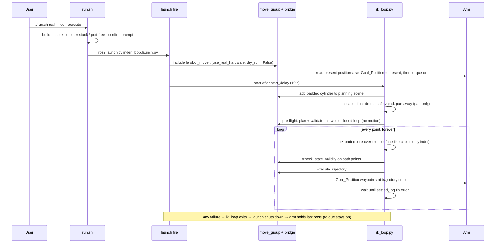

# Architecture

How `lerobot_ik_demo` moves the SO-101's gripper in a loop *around and over* a cylinder, in simulation
(mock hardware) and on the real arm through the same code path.

## 1. Requirements

| # | Requirement | How it is met |
|---|---|---|
| R1 | Loop the gripper through a list of Cartesian positions using inverse kinematics | `so101_kin.py` (closed-form IK) + `ik_loop.py` |
| R2 | Positions on either side of a cylinder and one on top; never go through it | Cylinder is a MoveIt collision object; hops that would clip it are routed over the top (`arm_client.plan_to`) |
| R3 | Same code for simulation and the physical arm | Scripts only talk to `move_group`; the arm behind it is mock hardware or the Feetech bridge |
| R4 | Sim-to-real safety | Padded collision geometry, pre-flight of the whole loop, dry-run bridge mode, stop-on-first-error, torque-on hazard fix ([§6](#6-safety-layers)) |
| R5 | One command to run it | `run.sh` → `launch/cylinder_loop.launch.py` |
| R6 | Cylinder visible in RViz | It lives in `move_group`'s planning scene, shown by MotionPlanning ▸ Scene Geometry |

## 2. Component view


*The loop only ever talks to `move_group`. Mock hardware and the real Feetech bridge sit behind the same
`FollowJointTrajectory` interface, so the identical code runs on both. The orange return path is what makes
sim-to-real different: the real arm comes back sagged, every hop re-plans from that measured state, and the
3 cm safety pad is the same size as the error. (Vector version: [architecture.svg](architecture.svg).)*

**Packages** (all in this workspace):

| Package | Role in this project | Modified? |
|---|---|---|
| `lerobot_description` | URDF/xacro, meshes. The IK reads joint origins/limits from it. | no |
| `lerobot_controller` | `ros2_control` + `joint_trajectory_controller` for mock hardware | no |
| `lerobot_moveit` | `move_group`, SRDF, RViz config, the launch file we include | no |
| `lerobot_hardware` | Feetech serial bridge exposing `FollowJointTrajectory` | **yes** — `feetech_bus.py` `connect()` ([§6](#6-safety-layers)) |
| `lerobot_ik_demo` | IK, routing, loop, launcher, docs | new |

The MoveIt → `FollowJointTrajectory` → servo-bridge layering is the same structure as
[atom-robotics-lab/SO-101-ARM](https://github.com/atom-robotics-lab/SO-101-ARM), which this workspace's
`lerobot_hardware` + `lerobot_moveit` already implement; that repo was used as a design reference only.

## 3. Runtime sequence (`./run.sh real --live --execute`)



## 4. Frames and geometry

* **Frame:** everything is in the `base` frame (`world` → `base` is an identity fixed joint).
  **`+x` = the arm's left, `−y` = forward, `+z` = up** (viewed from behind the arm).
* **Pan axis** (joint 1) is a vertical line through `(0.0208, −0.0231)`, not the base origin — measure
  the cylinder from *it* (see [HARDWARE_BRINGUP.md](HARDWARE_BRINGUP.md#3-place-and-measure-the-cylinder)).
* **Joint 1 sign:** positive q1 swings the tool toward −x (the arm's **right**, viewed from behind).
* **Cylinder:** real 14 cm ⌀ × 18 cm. Planning uses a **padded** copy: radius +3 cm, top +3 cm
  (`BUFFER_MARGIN` in `add_obstacle_scene.py`) → r = 0.10 m, h = 0.21 m. `Cylinder` in `arm_client.py`.
* **Planned point:** the *gripper link origin* (child of joint 5). The jaw and wrist extend beyond it;
  their clearance is enforced by MoveIt's mesh collision check, not by the origin's position.

## 4a. Kinematics (`scripts/so101_kin.py`)

The forward-kinematics derivation and its check against MoveIt's `/compute_fk` are in
[`lerobot_moveit/docs/KINEMATICS.md`](../../lerobot_moveit/docs/KINEMATICS.md); this section covers the inverse.

The arm has 5 arm joints, so it can hold a position plus a *tool pitch* but not an arbitrary 6D pose.
MoveIt's KDL solver needs a full, exactly reachable 6D pose, so the package solves position + pitch directly,
reading the geometry from the URDF so it can't drift from `lerobot_description`. The derivation, two worked
examples, and measured comparisons with MoveIt are in [INVERSE_KINEMATICS.md](INVERSE_KINEMATICS.md); in short:

1. **q1** (pan) from the target's azimuth about the pan axis.
2. **q2, q3**: 2-link planar solve for the gripper origin's radius/height (implemented as a damped Newton
   iteration seeded from the previous solution, so a path stays on one elbow branch; the closed-form law-of-cosines
   version is derived in INVERSE_KINEMATICS.md).
3. **q4** = pitch − q2 − q3, where *pitch = q2 + q3 + q4* (joints 2–4 are parallel).
4. **q5** (wrist roll) held at its current value — it does not move the gripper origin.

Verified: FK equals MoveIt's `/compute_fk` for the home pose; IK round-trips to < 1 mm
(`test/test_kinematics.py`). `time_parameterize` produces a trapezoidal velocity profile capped at
`--speed` rad/s, zero velocity at both ends.

## 5. Planning (`scripts/arm_client.py`)

`ArmClient.plan_to(target)` plans from the **measured** joint state:

1. Reject targets inside the padded footprint below the arch height (`z_arch` = padded top + `--clearance`).
2. If the straight line from the current tip to the target passes within *padded radius + 3 cm* of the
   cylinder axis below `z_arch` → **route over the top**: lift at the start point to `z_arch`, cross at
   `z_arch`, descend onto the target. Otherwise go straight.
3. Densify to 1 cm steps, solve IK point by point, easing tool pitch along the path.
   Try target pitches `current ± k·10°` (k = 0…9) until one gives a valid path.
4. Validate: gripper origin ≥ padded top + 1 cm whenever inside the footprint, and every second state
   passes MoveIt's `/check_state_validity` (padded cylinder + self-collision).
5. Time-parameterise and send via `/execute_trajectory`; after execution, wait until the arm has settled.

Also here: `plan_escape()` — if the arm *starts* inside the safety pad, a **pan-only** retreat that is
accepted only while the tip keeps moving away from the cylinder axis, plus ~8° extra margin, and refused if
the tip is within 2 cm of the *real* cylinder.

`ik_loop.py` adds the **pre-flight**: it plans the entire closed loop (each hop from the previous hop's
planned end state, including the closing hop) with no motion, drops unreachable points, and refuses to run
with fewer than two.

## 6. Safety layers

| Layer | Where | What it stops |
|---|---|---|
| Padded collision geometry | `add_obstacle_scene.py` | tape-measure / calibration error up to 3 cm |
| Keep-out on targets | `arm_client.plan_to` | targets inside the cylinder |
| Own footprint check | `arm_client._check_path` | "over" paths that dip into the cylinder |
| MoveIt validity on the path | `/check_state_validity` | arm links hitting the cylinder or itself |
| Joint-jump check (0.3 rad/point) | `so101_kin.solve_path` | IK elbow-branch flips |
| Whole-loop pre-flight | `ik_loop.preflight` | a loop that would fail mid-run |
| Plan from measured state; stop on first failure | `ik_loop` | continuing after the arm ends inside the pad |
| Re-plan + retry (≤ 2×) only if execution was rejected *and the arm has not moved* | `arm_client.go` | MoveIt's start-state check (0.01 rad) tripping on sag drift during planning; a failure after motion started is never retried |
| Plan-only default | `run.sh`, launch | accidental motion |
| Bridge `dry_run:=True` default | `lerobot_hardware` | writes to servos |
| `--live` + confirmation prompt | `run.sh` | starting live motion by accident |
| One-stack / port-free check | `run.sh` | two bridges on one serial port |
| Clamp abort | `feetech_bus.write_positions_rad` | commands outside the servo's calibrated range |
| Conservative servo velocity/accel | bridge params `goal_velocity=150`, `acceleration=20` | fast moves |
| **Goal = present before torque-on** | `feetech_bus.connect` | see below |

**Torque-on hazard (fixed).** The STS3215's `Goal_Position` register is `0` after power-up (or holds the
last session's goal). Enabling torque drives the servo *toward that register*, not toward where the arm
is. The original `connect()` enabled torque without setting it — with the arm at ticks ~1500–3250, each
servo would have driven toward tick 0 (up to ~245° away). `connect()` now writes each servo's present
position into `Goal_Position` first. (These servos also turn torque on by themselves when a goal is
written while torque is off.)

## 7. Sim-to-real gap (known limitations)

* **Gravity sag / tracking error.** On the real arm the tip ends **~1–5 cm** off target (measured
  11–47 mm over many hops; joints 2 and 3 sag hardest), comparable to the 3 cm pad. The plan is
  re-made from the measured state each hop, so errors do not accumulate, but they *do* eat the
  clearance. Mock hardware tracks to < 1 mm, so **passing on mock says nothing about clearance on the real
  arm.** Mitigations not yet implemented: aim targets high to compensate sag; larger pad; slower/lighter.
* **The bridge reports success when the last waypoint is *sent***, not when the servo arrives
  (`lerobot_hardware/README.md`); the scripts therefore poll `/joint_states` until settled.
* **Origin-only planning** (see §4). Low targets right beside the cylinder are often refused for
  arm-body collision.
* **Tool pitch is free** but kept near the current pitch (±90° searched).
* **Wrist roll** is not planned; it stays wherever it is.
* **Calibration.** Servo 5's home tick (4031) sits 64 ticks from the 4095 wrap; a wrist roll past it can
  read as a ±360° jump. See `lerobot_hardware/README.md` "Per-joint raw headroom".
* **Not covered:** Gazebo with the new scripts (untested); the gripper joint; dynamic obstacles.

## 8. Repository layout

```text
lerobot_ik_demo/
├── run.sh                        single entry point (build, checks, launch)
├── requirements.txt              Python + ROS dependencies
├── package.xml / CMakeLists.txt
├── launch/
│   ├── cylinder_loop.launch.py   MoveIt (+mock|real) + ik_loop; used by run.sh
│   ├── so101_gazebo_obstacle.launch.py, so101_moveit_obstacle.launch.py   (original Gazebo demo)
├── config/
│   ├── loop_points.yaml          default loop: left side → top → right side (cylinder-relative)
│   └── loop_points_extended.yaml 7-point variant
├── scripts/
│   ├── so101_kin.py              ROS-free FK/IK/time-parameterisation
│   ├── arm_client.py             routing, validation, escape, execution (shared)
│   ├── ik_loop.py                the loop (pre-flight, --escape, --execute)
│   ├── click_to_move.py          move to points clicked in RViz (Publish Point)
│   ├── over_the_top_demo.py      scripted left→over→right crossing
│   ├── add_obstacle_scene.py     add the padded cylinder to MoveIt (--object-xy X Y)
│   └── loop_obstacle_demo.py     original Gazebo-demo base-joint sweep
├── worlds/obstacle_world.sdf     Gazebo world (original demo)
├── test/test_kinematics.py       ROS-free unit tests
└── docs/  ARCHITECTURE.md  INVERSE_KINEMATICS.md (+ ik_calc.py)  HARDWARE_BRINGUP.md  GAZEBO_DEMO.md  architecture.svg (+ .png)
```
