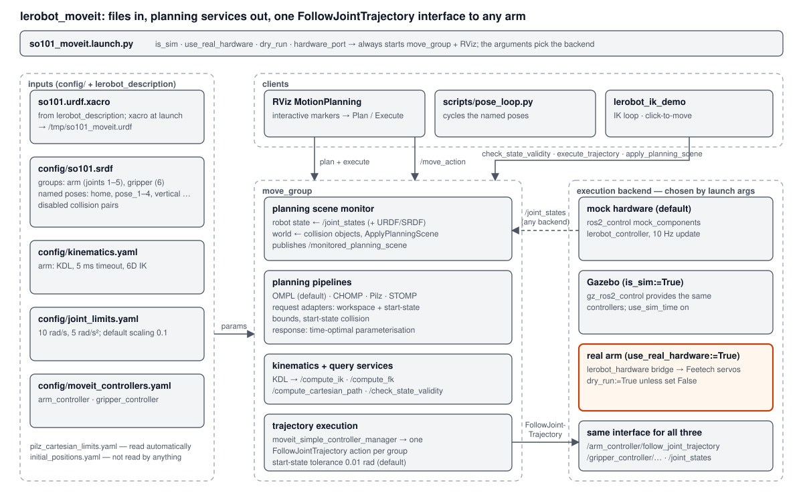

# lerobot_moveit

MoveIt 2 configuration and launch for the **SO-101** arm (5 joints + gripper, ROS 2 Jazzy): planning
(`move_group`), RViz visualisation/control, and a choice of arm behind it — **mock hardware**, **Gazebo**, or the
**real Feetech-servo arm** through `lerobot_hardware`. MoveIt is configured once; only a launch argument changes
which arm it drives.



*Inputs → `move_group` → one `FollowJointTrajectory` interface → any backend. Full description:
[docs/ARCHITECTURE.md](docs/ARCHITECTURE.md).*

## Quick start

```bash
cd ~/ros2_ws && export PATH=/usr/bin:$PATH        # ROS needs the system python, not conda
source /opt/ros/jazzy/setup.bash && source install/setup.bash

ros2 launch lerobot_moveit so101_moveit.launch.py                                  # mock hardware (no arm needed)
ros2 launch lerobot_moveit so101_moveit.launch.py \
  use_real_hardware:=True dry_run:=True hardware_port:=/dev/ttyACM0                # real arm, read-only dry run
ros2 launch lerobot_moveit so101_moveit.launch.py \
  use_real_hardware:=True dry_run:=False hardware_port:=/dev/ttyACM0               # real arm — MOVES
```

Gazebo: start Gazebo first (`lerobot_description`'s `so101_gazebo.launch.py`, or `lerobot_ik_demo`'s
obstacle world), then `ros2 launch lerobot_moveit so101_moveit.launch.py is_sim:=True`.

In RViz use the **MotionPlanning** panel → **Planning** tab: drag the interactive markers (or pick a named goal
state from the dropdown), press **Plan**, then **Execute**.

**⚠️ Only ever run one instance of this launch (one `hardware_bridge`) against the arm at a time** — two bridges
on one serial port crash both. See `lerobot_hardware/README.md`.

## Launch arguments

| Argument | Default | Meaning |
|---|---|---|
| `is_sim` | `False` | `True`: Gazebo (started separately) provides `robot_state_publisher` and `ros2_control`; only the controller spawners run here. `move_group` uses sim time. |
| `use_real_hardware` | `False` | `True`: skip the mock/Gazebo controller stack and start `lerobot_hardware`'s servo bridge. |
| `dry_run` | `True` | Real hardware only. `True`: the bridge connects **read-only** and only logs the servo writes it *would* make. Must be explicitly `False` to move the arm. |
| `hardware_port` | `/dev/ttyACM0` | Serial port of the real arm. |

What each mode starts (always `move_group` + `rviz2`):

| Mode | Also started |
|---|---|
| mock (default) | `lerobot_controller`: `robot_state_publisher`, `ros2_control_node` (mock_components), spawners for `joint_state_broadcaster`, `arm_controller`, `gripper_controller` |
| `is_sim:=True` | the three controller spawners only |
| `use_real_hardware:=True` | `lerobot_hardware` bridge + `robot_state_publisher` |

## Requirements

| Needed | Notes |
|---|---|
| ROS 2 **Jazzy**, Ubuntu 24.04 | |
| `ros-jazzy-moveit`, `moveit_configs_utils`, `moveit_simple_controller_manager`, `moveit_planners`, `moveit_ros_visualization` | planning, RViz plugin, builder used by the launch file |
| `rviz2`, `xacro`, `robot_state_publisher`, `ros2_control` + `ros2_controllers` | |
| sibling packages: `lerobot_description`, `lerobot_controller`, `lerobot_hardware` | URDF/meshes, mock controllers, real-arm bridge |
| system **Python 3.12** with `numpy` (only for `docs/fk_calc.py`) | rclpy is ABI-locked to 3.12 — a conda `base` python first on `PATH` breaks it |
| real arm only: `feetech-servo-sdk` (`scservo_sdk`), serial permission (`dialout` group) | used by `lerobot_hardware` |

```bash
cd ~/ros2_ws && rosdep install --from-paths src --ignore-src -r -y
colcon build --packages-select lerobot_description lerobot_controller lerobot_hardware lerobot_moveit
```

## Package contents

| Path | Purpose |
|---|---|
| `launch/so101_moveit.launch.py` | The launch file: builds the MoveIt config, starts `move_group`, RViz and the chosen backend |
| `config/so101.srdf` | Planning groups (`arm` = joints 1–5, `gripper` = joint 6), **named poses**, disabled collision pairs |
| `config/kinematics.yaml` | KDL solver for group `arm` (5 ms timeout, `position_only_ik: False`) |
| `config/joint_limits.yaml` | Velocity/acceleration limits (10 rad/s, 5 rad/s²) and default scaling 0.1 |
| `config/moveit_controllers.yaml` | `MoveItSimpleControllerManager` → `arm_controller` (1–5) and `gripper_controller` (6), both `FollowJointTrajectory` |
| `config/pilz_cartesian_limits.yaml` | Pilz planner limits (loaded automatically) |
| `config/initial_positions.yaml` | Zeros; **not read by anything** |
| `config/moveit.rviz` | RViz layout: MotionPlanning, scene geometry (green), *Publish Point* tool → `/clicked_point`, fixed frame `base` |
| `scripts/pose_loop.py` | Cycles the named poses through `/move_action` and verifies each move |
| `docs/` | [ARCHITECTURE.md](docs/ARCHITECTURE.md), [KINEMATICS.md](docs/KINEMATICS.md) (forward-kinematics calculation), `fk_calc.py`, diagram |

## What `move_group` exposes

Planning and execution are MoveIt's standard interfaces — this package adds no custom messages.

| Use | Interface |
|---|---|
| Plan (+ execute) a goal | action `/move_action` (`moveit_msgs/action/MoveGroup`) |
| Execute your own trajectory | action `/execute_trajectory` |
| Kinematics | services `/compute_fk`, `/compute_ik`, `/compute_cartesian_path` |
| Collision check of a joint state | service `/check_state_validity` |
| Add/inspect obstacles | services `/apply_planning_scene`, `/get_planning_scene`; topic `/monitored_planning_scene` |
| Robot state in | topic `/joint_states` |
| Commands out | `/arm_controller/follow_joint_trajectory`, `/gripper_controller/follow_joint_trajectory` |

Examples:

```bash
# forward kinematics of a joint state (see docs/KINEMATICS.md for how it is computed)
ros2 service call /compute_fk moveit_msgs/srv/GetPositionFK \
  "{header: {frame_id: base}, fk_link_names: [gripper],
    robot_state: {joint_state: {name: ['1','2','3','4','5','6'], position: [0,0,0,0,0,0]}}}"

# planner in use and pipelines available
ros2 param get /move_group default_planning_pipeline        # ompl
ros2 param get /move_group planning_pipelines               # ompl, chomp, pilz_industrial_motion_planner, stomp
```

## Forward kinematics

The pose of every link follows from the URDF by one matrix product per joint,
`T_i = T_{i−1} · T_origin,i · Rz(q_i)`. [docs/KINEMATICS.md](docs/KINEMATICS.md) works this through: the joint
table, the zero-pose and `home` calculations, a closed-form planar formula for the gripper origin
(`p₂ + R(q2)a + R(q2+q3)b + R(q2+q3+q4)c`, then a pan by `q1`), and a comparison with MoveIt's `/compute_fk`
that agrees to 3·10⁻¹⁶ m. Reproduce it with `python3 docs/fk_calc.py [--steps | --planar | --moveit]`.

## Named poses

`config/so101.srdf` defines named `group_state`s MoveIt can plan straight to (via RViz's goal-state dropdown,
`move_group.setNamedTarget("...")`, or `pose_loop.py`). Current poses:

| Name | Description |
|---|---|
| `home` | Calibration reference pose (see `lerobot_hardware/README.md`). |
| `pose_1`..`pose_4` | Small variations around `home`, each with a different gripper opening. |
| `vertical` | Elbow (joint 3) swung to `+1.40` rad. |
| `vertical_down` | Elbow swung to `-0.85` rad (kept short of `-1.40` for table clearance). |

**To add a pose:** use MoveIt Setup Assistant's "Robot Poses" tab, or edit `config/so101.srdf` — add one
`<group_state name="..." group="arm">` block (joints 1–5) and one `group="gripper"` block (joint 6):

```xml
<group_state name="my_pose" group="arm">
    <joint name="1" value="0.20" />
    <joint name="2" value="-0.20" />
    <joint name="3" value="0.40" />
    <joint name="4" value="-0.15" />
    <joint name="5" value="0.10" />
</group_state>
<group_state name="my_pose" group="gripper">
    <joint name="6" value="0.20" />
</group_state>
```

Read live joint values to use as targets with `ros2 topic echo /joint_states --once`.

**Before committing a pose that pushes any joint far from `home`**, check it against each servo's live raw-tick
headroom (`lerobot_hardware/README.md` → *Per-joint raw headroom is not symmetric*) — the URDF limits alone don't
guarantee a value is reachable at the current calibration, and don't account for physical obstructions (e.g. the
mounting table).

## `scripts/pose_loop.py`

Cycles the arm through every named pose in `so101.srdf`, with no user input, verifying each move by polling
`/joint_states` against the commanded target.

```bash
ros2 run lerobot_moveit pose_loop.py                 # 5 cycles (default)
ros2 run lerobot_moveit pose_loop.py --cycles 0        # loop forever
ros2 run lerobot_moveit pose_loop.py --cycles 1 --pause 3.0
```

Needs the launch above already running (it reads the SRDF live and talks to `/move_action`; it doesn't start
MoveIt). Ctrl+C stops it cleanly. The verify tolerance is `0.05` rad (~3°), calibrated to this arm's observed
tracking accuracy under load (`lerobot_hardware/README.md` → *Known limitations*).

## Working with the real arm

* Start with `dry_run:=True` (the default) and check `/joint_states` matches the physical arm; all five arm
  joints must read **inside the URDF limits** or MoveIt refuses to plan (`Start state is outside bounds`).
* **Plan slower than MoveIt's defaults.** The default scaling allows ≈ 1 rad/s; the bridge's servo cap is
  ≈ 0.23 rad/s, so fast plans outrun the servos. Lower RViz's *velocity scaling* (≈ 0.02 ≈ 0.2 rad/s).
* Execution can be rejected up front with `start point deviates from current robot state more than 0.01`
  when gravity sag moves a joint between planning and execution — nothing moves; plan again.
* The tip lands a few centimetres from the FK of the commanded pose under load; keep safety margins.
* For a complete, guarded loop around an obstacle, see `lerobot_ik_demo` (`./run.sh`).

## Known issues

Details and advice in [docs/ARCHITECTURE.md § Known issues](docs/ARCHITECTURE.md#10-known-issues-and-limitations).
The ones that bite first:

1. KDL with full-pose IK on a 5-DOF arm fails for most RViz interactive-marker goals; for position goals try
   `position_only_ik: True` (untested here) or use the closed-form IK in `lerobot_ik_demo`.
2. Default MoveIt speed scaling exceeds the real servos' speed cap.
3. `initial_positions.yaml` is unused; the SRDF has duplicate `disable_collisions` pairs and no end-effector.
4. `package.xml` dependency names were corrected (`moveit_configs_utils`, plus the MoveIt runtime packages).

## Related packages

`lerobot_description` (URDF/meshes) · `lerobot_controller` (mock/Gazebo controllers) · `lerobot_hardware` (real-arm
bridge) · `lerobot_ik_demo` (IK loop around a cylinder, built on this package without modifying it).
Design reference for the MoveIt → `FollowJointTrajectory` → servo-bridge layering:
[atom-robotics-lab/SO-101-ARM](https://github.com/atom-robotics-lab/SO-101-ARM).

License: Apache-2.0.
