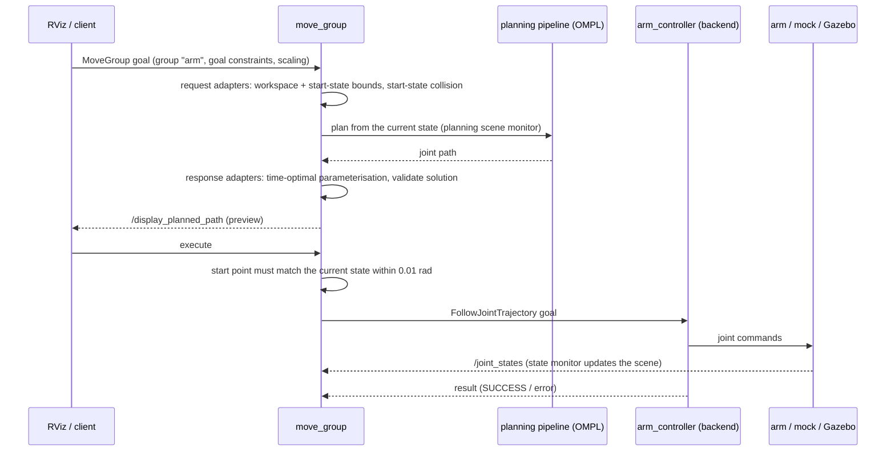

# lerobot_moveit — architecture

MoveIt 2 configuration for the SO-101: it turns the robot's URDF, an SRDF and four YAML files into a running
`move_group`, opens RViz, and connects MoveIt to **whichever arm is behind it** — mock hardware, Gazebo, or the
real Feetech servos — through one standard interface (`FollowJointTrajectory`).

## 1. Requirements this package satisfies

| # | Requirement | How |
|---|---|---|
| R1 | Plan and execute motions for the 5-DOF arm + gripper | `move_group` with SRDF groups `arm` (joints 1–5) and `gripper` (6) |
| R2 | Same MoveIt setup for simulation and the physical arm | One launch file; `is_sim` / `use_real_hardware` select the backend, MoveIt itself is unchanged |
| R3 | Don't move the real arm by accident | `dry_run` defaults to `True`; live motion needs an explicit `dry_run:=False` |
| R4 | Visualise and drive from RViz | Bundled `moveit.rviz` (MotionPlanning, scene geometry, *Publish Point*) |
| R5 | Repeatable named poses | SRDF `group_state`s + `scripts/pose_loop.py` |
| R6 | Usable as a base by other packages | Exposes MoveIt's standard services/actions; `lerobot_ik_demo` builds on it without modifying it |

## 2. Component view


*Inputs (left) become `move_group`'s parameters through `MoveItConfigsBuilder`. Clients (top) talk to
`move_group` only. `move_group` reaches the arm only through `FollowJointTrajectory`, so mock hardware, Gazebo
and the real bridge are interchangeable; `/joint_states` flows back into the planning scene monitor.
(PNG copy: [architecture.png](architecture.png).)*

## 3. Launch composition — what starts in each mode

`launch/so101_moveit.launch.py` always starts **`move_group`** and **`rviz2`**. The arguments decide the rest:

| | `is_sim:=False`, `use_real_hardware:=False` (default) | `is_sim:=True` | `use_real_hardware:=True` |
|---|---|---|---|
| Backend | ros2_control **mock** hardware | **Gazebo** (launched separately) | **Feetech bridge** (`lerobot_hardware`) |
| `lerobot_controller` launch included | yes | yes (spawners only) | **no** |
| `robot_state_publisher` | from `lerobot_controller` | from the Gazebo launch | started by this launch |
| `ros2_control_node` | started (mock_components) | provided by `gz_ros2_control` | — |
| controller spawners | `joint_state_broadcaster`, `arm_controller`, `gripper_controller` | same three | — (the bridge *is* the controller) |
| `lerobot_hardware` bridge | — | — | started; `dry_run` and `hardware_port` apply |
| `move_group` `use_sim_time` | false | true | false |

Design point: the bridge (`lerobot_hardware`) does not use `ros2_control`; it serves the same two
`FollowJointTrajectory` actions (`/arm_controller/…`, `/gripper_controller/…`) directly, so
`moveit_controllers.yaml` is identical in every mode.

## 4. How configuration reaches `move_group`

```python
moveit_config = (MoveItConfigsBuilder("so101", package_name="lerobot_moveit")
    .robot_description(file_path="/tmp/so101_moveit.urdf")            # xacro output, see below
    .robot_description_semantic(file_path="config/so101.srdf")
    .trajectory_execution(file_path="config/moveit_controllers.yaml")
    .to_moveit_configs())
```

`to_moveit_configs()` also loads, **by default file name**, `config/kinematics.yaml` and
`config/joint_limits.yaml`, all planning pipelines it can find (here: OMPL, CHOMP, Pilz, STOMP, from
MoveIt's built-in defaults — the package has no `*_planning.yaml`), the planning-scene-monitor defaults, and —
because the Pilz pipeline is present — `config/pilz_cartesian_limits.yaml`. `config/initial_positions.yaml`
is **not read by anything** (a Setup-Assistant leftover).

The URDF is produced when the launch file is *evaluated*: `os.system("xacro so101.urdf.xacro > /tmp/so101_moveit.urdf")`
(without `is_sim`, which doesn't matter for kinematics/collision). The `Cannot infer URDF/SRDF … using
config/so101.urdf` warnings printed at startup come from the builder's auto-detection and are harmless
because explicit file paths are given.

## 5. Runtime interface of `move_group`

Verified on a running mock stack:

| Kind | Name | Purpose |
|---|---|---|
| Action | `/move_action` (`MoveGroup`) | plan (+ execute) a goal — what RViz and `pose_loop.py` use |
| Action | `/execute_trajectory` (`ExecuteTrajectory`) | execute a trajectory you computed yourself |
| Action | `/sequence_move_group` (`MoveGroupSequence`) | Pilz sequences |
| Service | `/compute_ik`, `/compute_fk`, `/compute_cartesian_path` | kinematics queries |
| Service | `/check_state_validity` | collision/limit check of a joint state |
| Service | `/apply_planning_scene`, `/get_planning_scene` | add/inspect obstacles |
| Service | `/plan_kinematic_path`, `/plan_sequence_path`, `/get_planner_params`, `/set_planner_params`, `/query_planner_interface` | planner access |
| Service | `/get_urdf`, `/load_geometry_from_file`, `/save_geometry_to_file`, `/load_map`, `/save_map`, `/clear_octomap` | model / scene I/O |
| Topic (out) | `/monitored_planning_scene`, `/display_planned_path`, `/display_contacts`, `/robot_description(_semantic)`, `/trajectory_execution_event` | what RViz shows |
| Topic (in) | `/joint_states`, `/planning_scene`, `/collision_object`, `/attached_collision_object` | robot state and scene updates |
| Action (out) | `/arm_controller/follow_joint_trajectory`, `/gripper_controller/follow_joint_trajectory` | commands to the backend |

The `Action server: /recognize_objects not available` line in RViz's log is RViz's MotionPlanning panel looking
for an object-recognition server this setup doesn't have; harmless. Likewise
`No 3D sensor plugin(s) defined for octomap updates` — there is no sensor config.

## 6. Plan → execute sequence



The default velocity/acceleration scaling is **0.1** (`joint_limits.yaml`), applied to limits of 10 rad/s and
5 rad/s² — i.e. ≈ 1 rad/s peak, 0.5 rad/s².

## 7. Backends

* **Mock** — `mock_components/GenericSystem` behind `ros2_control` (`lerobot_controller`): commands are echoed
  back as states, so tracking is essentially perfect. `controller_manager` update rate is **10 Hz**.
* **Gazebo** — `gz_ros2_control/GazeboSimSystem` (selected by the xacro `is_sim` argument); physics-based,
  but see `lerobot_description`'s launch for the world.
* **Real** — `lerobot_hardware/so101_hardware_bridge.py`: reads the servos at 30 Hz for `/joint_states`,
  serves the two `FollowJointTrajectory` actions and writes each waypoint's `Goal_Position` at its trajectory
  time. It caps servo speed with `goal_velocity = 150` steps/s ≈ **0.23 rad/s** and `acceleration = 20`. It reports
  `SUCCESS` when the last waypoint is *sent*, not when the servo arrives.

**Integration caveat.** MoveIt's default limits allow ≈ 1 rad/s while the bridge's servo cap is ≈ 0.23 rad/s, so a
trajectory planned at the defaults **asks for faster motion than the servos deliver** and the arm lags the plan.
Lower the RViz *velocity scaling* (≈ 0.02 gives ≈ 0.2 rad/s) or slow your own trajectories, especially near obstacles.

## 8. Frames

* Planning frame / RViz fixed frame: **`base`** (`world → base` is an identity fixed joint).
  **+x = arm's left, −y = forward, +z = up.**
* TF comes from `robot_state_publisher` (URDF + `/joint_states`).
* Kinematics and the closed-form forward-kinematics derivation: [KINEMATICS.md](KINEMATICS.md).

## 9. Package layout

```text
lerobot_moveit/
├── README.md
├── package.xml / CMakeLists.txt          installs config/ launch/ scripts/
├── launch/so101_moveit.launch.py         the launch file described in §3–§4
├── config/
│   ├── so101.srdf                        groups, named poses, disabled collision pairs
│   ├── kinematics.yaml                   KDL for group "arm"
│   ├── joint_limits.yaml                 velocity/acceleration limits, default scaling
│   ├── moveit_controllers.yaml           MoveItSimpleControllerManager → the two FollowJointTrajectory actions
│   ├── pilz_cartesian_limits.yaml        Pilz limits (loaded automatically)
│   ├── initial_positions.yaml            unused
│   └── moveit.rviz                       RViz layout (MotionPlanning, Publish Point tool, scene geometry)
├── scripts/pose_loop.py                  cycles the named poses through /move_action
└── docs/  ARCHITECTURE.md  KINEMATICS.md  fk_calc.py  architecture.svg (+ .png)
```

## 10. Known issues and limitations

| # | Issue | Effect / advice |
|---|---|---|
| 1 | **KDL with `position_only_ik: False`** on a 5-DOF arm | 6-D IK converges only for orientations the arm can already reach exactly, so RViz interactive-marker goals often fail even when the position is reachable. For position goals try `position_only_ik: True` (untested here), or use the closed-form IK in `lerobot_ik_demo`. |
| 2 | **Speed mismatch** (§7) | Plans at default scaling outrun the real servos. |
| 3 | **`package.xml`** previously named a non-existent dependency `moveit_config_utils` (the package is `moveit_configs_utils`) and omitted the MoveIt runtime packages | Fixed in this change; `rosdep install` failed on the old name. |
| 4 | **SRDF** has no `<end_effector>` and no `<virtual_joint>`; two `disable_collisions` pairs are duplicated (`base–lower_arm`, `lower_arm–upper_arm`) | Harmless; tidy when convenient. |
| 5 | `initial_positions.yaml` is unused | Mock hardware starts at zero regardless. |
| 6 | The URDF is generated by `os.system` at launch-file evaluation into a fixed `/tmp` path | Two launches at once share (and rewrite) the same file. |
| 7 | `move_group` exits with a segmentation fault on shutdown (seen as exit code −11 on Ctrl+C) | Cosmetic in our use; not investigated. |
| 8 | Joint limits are the URDF's; **servo raw headroom is asymmetric** | A pose inside the URDF limits can still be outside a servo's calibrated range (`lerobot_hardware/README.md`). |
| 9 | `MoveIt` start-state tolerance is the default **0.01 rad** | On the real arm, gravity sag can make execution be rejected up front (`start point deviates from current robot state`). Re-plan and retry. |

## 11. Extending

* **Add a named pose** — new `<group_state>` blocks in `so101.srdf` (README → *Named poses*).
* **Change the planner** — RViz's *Planning* tab, or `planner_id` in your `MoveGroup` request; add
  `config/ompl_planning.yaml` to override OMPL parameters.
* **Add a controller / joint group** — extend `moveit_controllers.yaml` and provide a matching action server on the backend.
* **Add obstacles** — `/apply_planning_scene` (see `lerobot_ik_demo/scripts/add_obstacle_scene.py`).
